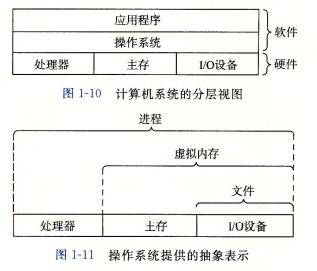

# 计算机
## 思考过程
### 计算机是做什么的
* 计算机是为了帮助人们解决复杂繁多的计算所产生的
### 计算机由什么组成
* 计算机的硬件组成 
### 计算机如何起作用的
* 计算机依靠软件，硬件搭配起作用
#### 硬件 
* CPU ：由运算器和控制器组成
* 主存（内存）
* 辅助存储器（硬盘）
* 输入输出设备
* 总线
* 主板
#### 操作系统
* 操作系统是对硬件的抽象，同时也是提供了应用软件运行的环境。
* 操作系统是如何起作用的？
#### 应用程序
* 应用程序分门别类的完成各种任务
#### 总论
* 当我们启动一个程序的时候，程序会通知操作系统，并通过操作系统提供的API来操作硬件从而实现我们的目的。
* 从下往上看，更能加深当程序运行的时候发生了什么
* boot 取自很早之前的开机问题：必须先运行程序，然后计算机才能启动，但是计算机不启动就无法运行程序
* 电源开始供电，主板芯片组启动，CPU从FFFF:0000H执行指令，跳转到BIOS开始自检 自检后将控制权交给操作系统
* 操作系统通过 LOADER 程序 载入内核 内核加载成功后  启动一个进程 启动后加载操作系统的其他模块
* 系统进入开机界面之后 就是要使用各种应用程序来协助我们完成各种任务了 这个时候各种应用程序实质就是利用操作系统功能的应用
* 双击应用程序 操作系统把程序拿到内存中 同时告知CPU开始执行内存中的程序 来实现我们的想法。

 

